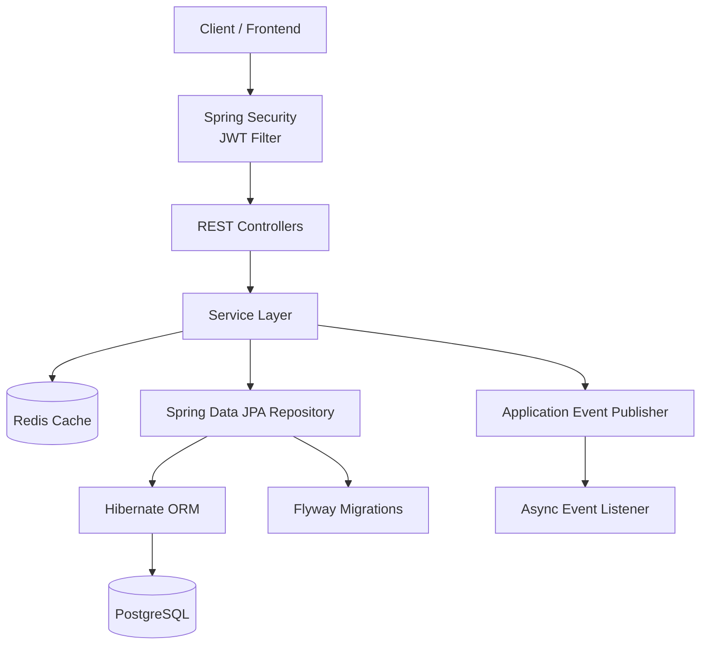
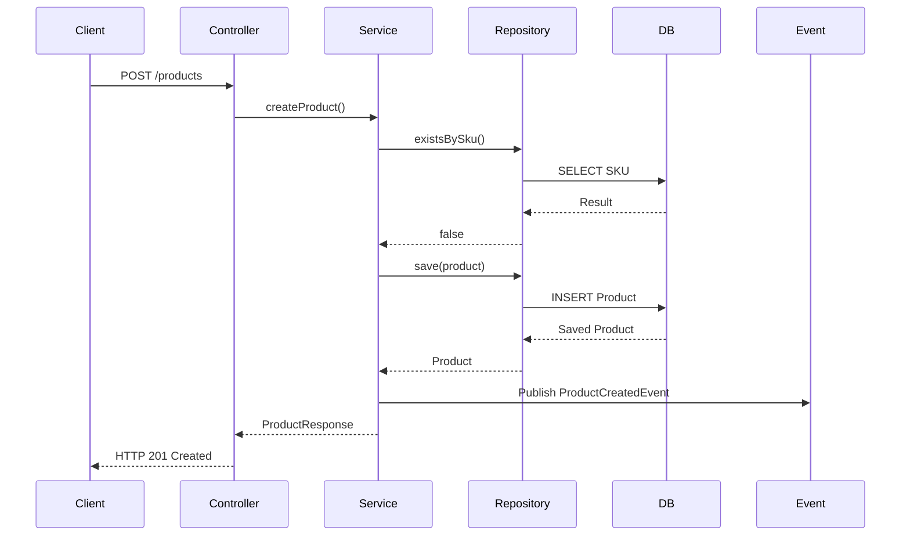
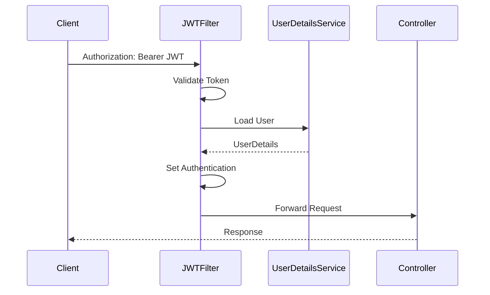
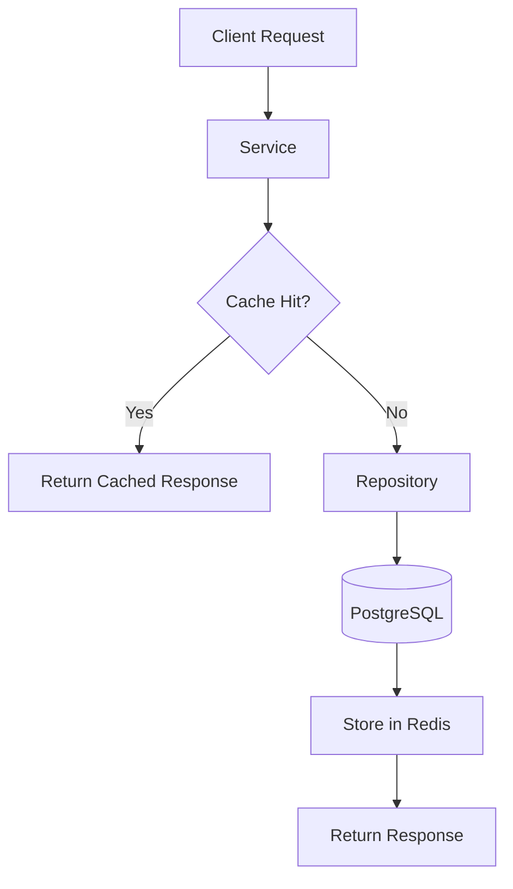
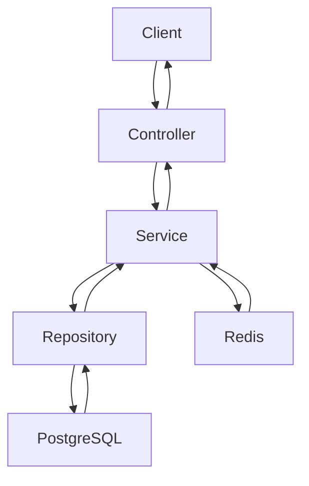
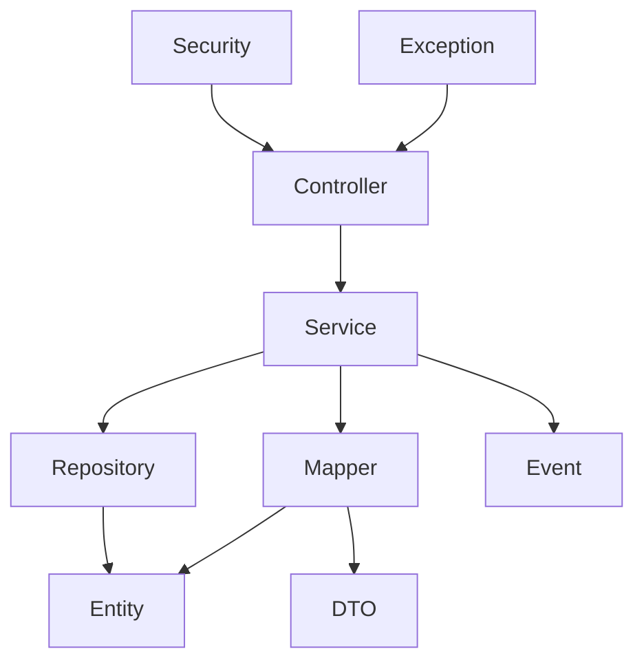
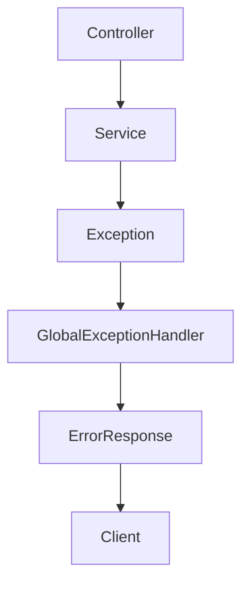
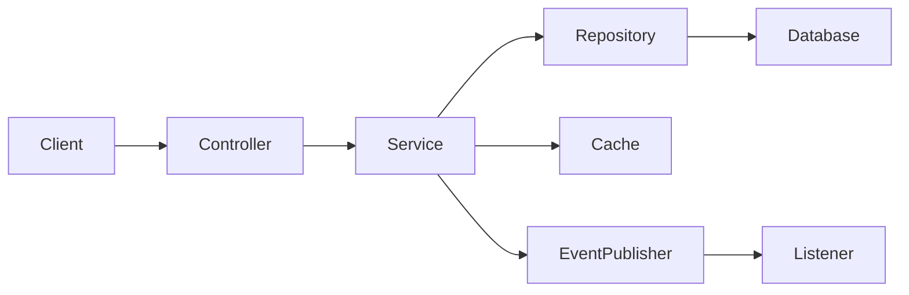
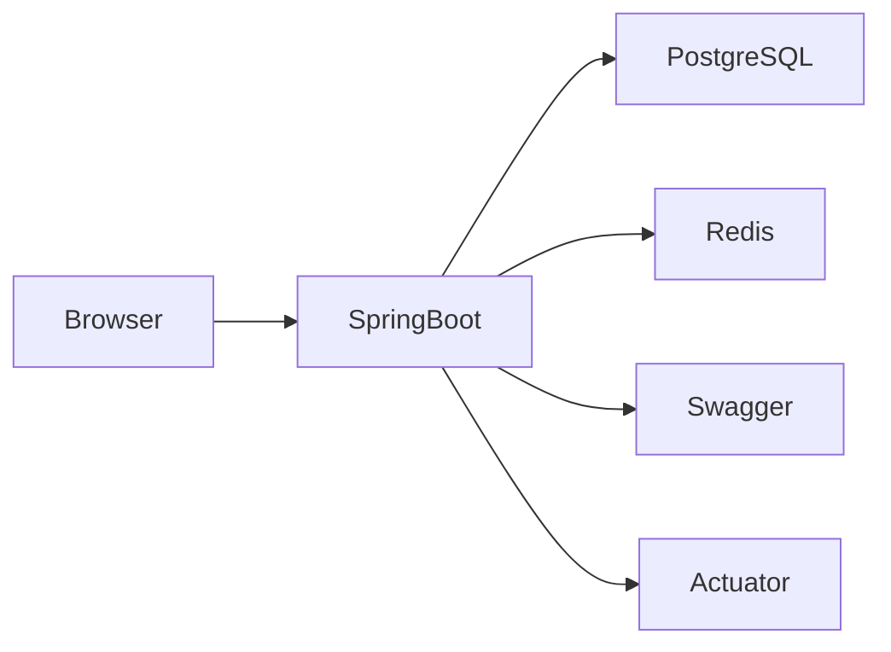

# System Architecture

## Overview

The Inventory Management System follows a **Layered (N-Tier) Architecture** with clear separation of concerns. Each layer has a single responsibility, making the application maintainable, testable, and scalable.

---

# High-Level Architecture

```text
                              Client
                                 │
                                 │ HTTP/HTTPS
                                 ▼
                    +---------------------------+
                    |      Spring Boot App      |
                    +---------------------------+
                                 │
                                 ▼
                      +---------------------+
                      |  Spring Security    |
                      | JWT Authentication  |
                      +---------------------+
                                 │
                                 ▼
                      +---------------------+
                      |     Controllers     |
                      |   REST Endpoints    |
                      +---------------------+
                                 │
                                 ▼
                      +---------------------+
                      |      Services       |
                      | Business Logic      |
                      +---------------------+
                          │            │
             Events       │            │ Cache
                          │            ▼
                          │      +------------+
                          │      |   Redis    |
                          │      +------------+
                          ▼
                 +----------------------+
                 | Application Events   |
                 +----------------------+
                          │
                          ▼
                Async Event Listeners

                                 │
                                 ▼
                      +---------------------+
                      |   Repositories      |
                      | Spring Data JPA     |
                      +---------------------+
                                 │
                                 ▼
                          Hibernate ORM
                                 │
                                 ▼
                          PostgreSQL
```

---

# Request Flow

A typical request flows through the following layers:

```text
Client
   │
   ▼
Security Filter Chain
   │
   ▼
Controller
   │
   ▼
Validation
   │
   ▼
Service
   │
   ├── Business Rules
   ├── Cache Lookup
   ├── Event Publishing
   ├── Retry / Circuit Breaker
   └── Transaction
   │
   ▼
Repository
   │
   ▼
Hibernate
   │
   ▼
PostgreSQL
```

---

# Package Structure

```text
src/main/java

com.example.inventory
│
├── config
├── controller
├── dto
├── entity
├── event
├── exception
├── mapper
├── repository
├── security
├── service
├── util
└── InventoryApplication
```

---

# Layer Responsibilities

## Controller Layer

Responsibilities:

* Exposes REST APIs
* Accepts requests
* Performs request validation
* Delegates business logic to Service
* Returns HTTP responses

Does NOT contain business logic.

---

## Service Layer

Responsibilities:

* Business rules
* Transaction management
* Cache management
* Event publishing
* Validation beyond request constraints
* Repository orchestration

This is the core layer of the application.

---

## Repository Layer

Responsibilities:

* Database operations
* Custom queries
* Pagination
* Searching
* Sorting

Implemented using Spring Data JPA.

---

## Entity Layer

Responsibilities:

* Database mapping
* JPA annotations
* Optimistic locking
* Relationships

---

## DTO Layer

Responsibilities:

* API contracts
* Request objects
* Response objects

Keeps persistence models independent from REST APIs.

---

## Mapper Layer

Responsibilities:

* Convert DTO ↔ Entity
* Implemented using MapStruct
* Avoids boilerplate conversion code

---

## Security Layer

Responsibilities:

* JWT authentication
* Authorization
* Filter chain
* User authentication
* Password encoding

---

## Event Layer

Responsibilities:

* Publish domain events
* Async processing
* Decouple business logic

Example:

```
Product Created
        │
        ▼
Publish Event
        │
        ▼
Async Listener
        │
        ▼
Send Notification / Audit
```

---

# Database Architecture

```
Spring Data Repository
          │
          ▼
      Hibernate
          │
          ▼
 Persistence Context
          │
          ▼
     PostgreSQL
```

Flyway manages all database schema changes.

---

# Caching Architecture

```
Client
   │
   ▼
Controller
   │
   ▼
Service
   │
   ▼
Redis Cache
   │
Cache Hit?
 ├── Yes → Return Response
 └── No
       │
       ▼
 Repository
       │
       ▼
 PostgreSQL
       │
       ▼
 Update Cache
```

---

# Security Architecture

```
Client

Authorization: Bearer JWT

        │
        ▼
Security Filter

        │
Validate Token

        │
        ▼
Authentication

        │
        ▼
Controller
```

---

# Exception Handling

```
Controller

↓

Service

↓

Exception Thrown

↓

Global Exception Handler

↓

Standard Error Response
```

This ensures consistent error handling across the application.

---

# Technology Stack

| Layer         | Technology            |
| ------------- | --------------------- |
| Language      | Java 21               |
| Framework     | Spring Boot 3         |
| Security      | Spring Security + JWT |
| ORM           | Hibernate             |
| Database      | PostgreSQL            |
| Migration     | Flyway                |
| Cache         | Redis                 |
| Mapping       | MapStruct             |
| Resilience    | Resilience4j          |
| Build         | Maven                 |
| Documentation | OpenAPI (Swagger)     |

---

# Design Principles

The project follows these principles:

* Layered Architecture
* Separation of Concerns
* Dependency Injection
* Constructor Injection
* SOLID Principles
* DTO Pattern
* Repository Pattern
* Event-Driven Design
* Stateless Authentication
* Fail-Fast Validation
* Production-Oriented Configuration

---

# Future Improvements

Potential enhancements include:

* Kafka-based event streaming
* CQRS for read/write separation
* Hexagonal (Ports & Adapters) Architecture
* Distributed caching
* Kubernetes deployment
* OpenTelemetry distributed tracing
* CI/CD pipeline with GitHub Actions
* Multi-tenancy support

## Overall Architecture



## Create Product Flow



## JWT Authentication Flow


## Redis Cache Flow




## Update Product


## Package Structure



## Exception Handling



## Layered Architecture



## Deployment

